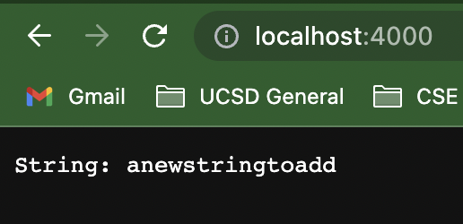
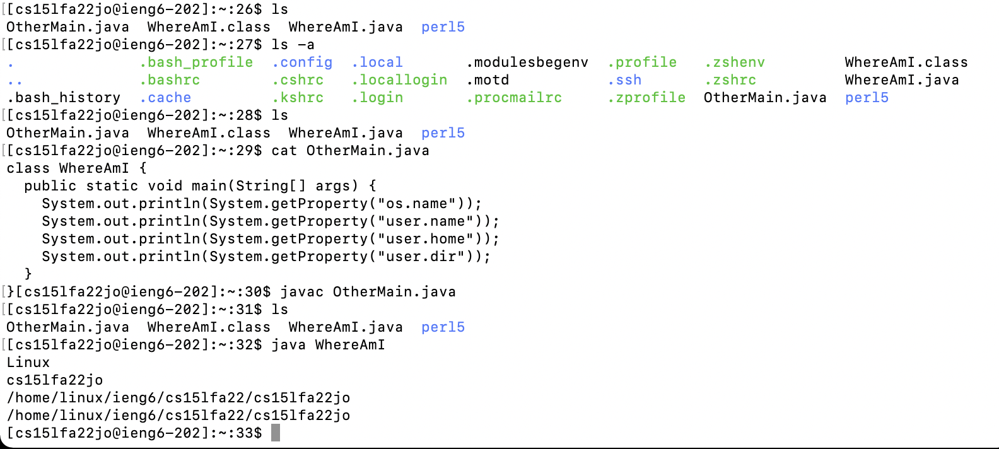
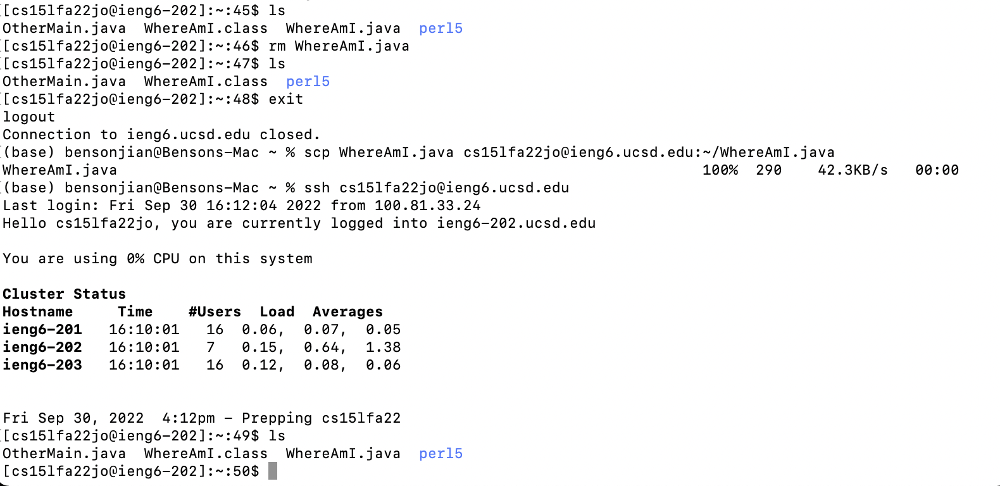
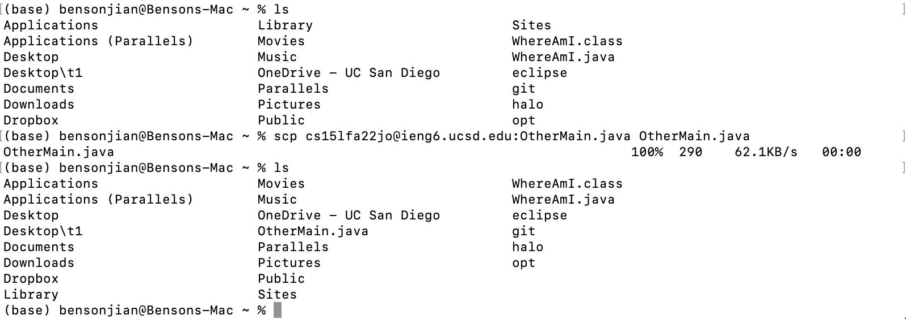
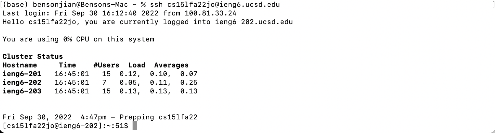
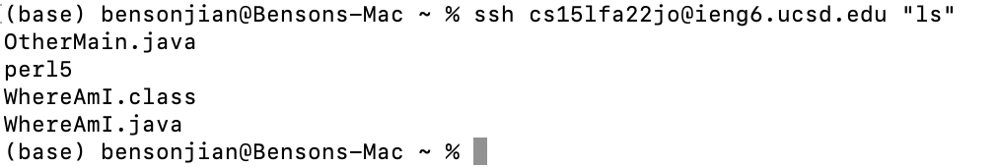

# Lab Report 2 Week 0

This is a tutorial of remotely connecting to ieng6 on MacOS operating system.

## Installing VScode

1. Go to *[Vscode.](https://code.visualstudio.com/)*

2. Download the version that corresponds to your operating system 

## Remotely Connecting

1. Find your course specific username by clicking the *[link](https://sdacs.ucsd.edu/~icc/index.php)*

2. (optional) *[Reset your password](https://sdacs.ucsd.edu/~icc/password.php)* as you need. The initial password to your course specific account is the same one to your SSO account by defalut.
    - Use your <strong>course specific username and select "no" </strong>if you don't want your password to your SSO account to change.

3. Open a command line window and type the commands below **Substitude your account name for "cs15lfa22jo".**
    ```
    bensonjian@benson-mac ~ % ssh cs15lfa2jo2@ieng6.ucsd.edu // Type your account
    
    The authenticity of host 'ieng6.ucsd.edu (128.54.70.238)' can't be established.
    Are you sure you want to continue connecting (yes/no/[fingerprint])? Yes // Type yes
    
    (cs15lfa22jo@ieng6.ucsd.edu) Password:  // Type in your password. It won't show up anything, just hit "enter" whenever you finish
    ```
    
    Example⬇️:
    


## Trying Some Commands

1. After logging in to your course specfic account, try some commands in the command line window, such as "ls", "ls -a", and etc.


## Moving Files with ```scp```

1. Before we start, please be aware of **your current directory all the time**. **Substitude your account name for "cs15lfa22jo".**

1. Use scp to copy files to ieng6. 
    
    ```
    // Copied file_name from the workstation to ieng6, named file_copy
    bensonjian@benson-mac ~ % scp path/file_name cs15lfa22jo@ieng6.ucsd.edu:path/file_copy
    ```
    Example⬇️：
    

2. Use scp to copy files from ieng6
    
    ```
    // Copied file_name from ieng6 to your workstation, named file_copy
    bensonjian@benson-mac ~ % scp cs15lfa22jo@ieng6.ucsd.edu:path/file_name path/file_copy
    ```
    Example⬇️：
    

## Setting an SSH Key

1. This step will save your time from entering the password each time you try to log in to your account.

2. Run "ssh-keygen" on your workstation.
    ```
    ~ % ssh-keygen
    Enter file in which to save the key (/Users/benson/.ssh/id_rsa): // Press enter to use the default path
    Enter passphrase (empty for no passphrase): 
    Enter same passphrase again: 
    Your identification has been saved in /Users/benson/.ssh/id_rsa.
    Your public key has been saved in /Users/benson/.ssh/id_rsa.pub.
    The key fingerprint is:
    SHA256: // some text
    The key's randomart image is: // some picture drawn by text
    ```
3. Create a .shh file in your ieng6 account if you don't have one.

4. Copy the file named id_rsa.pub from your workstation to your ieng6 account by running the command below.
    ```
    ~ % scp path/id_rsa.pub cs15lfa22@ieng6.ucsd.edu:~/.ssh/authorized_keys
    ```
5. ⬇️You made it successfully if it doesn't prompt you to enter your password when you try to log in.


## Optimizing Remote Running

 After completing all steps above, you can run command on the server directly from your workstation, by adding commands inside the quote("") then appending them to the end of the ssh command.

 In the example below⬇️, we basically log in the remote server, run ls, and exit the remote server：
 
 