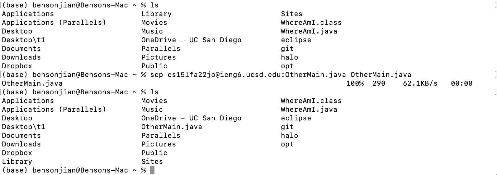

# Lab Report 2 Week 0

This is a tutorial of remotely connecting to ieng6 on MacOS operating system.

## Installing VScode
---
1. Go to *[Vscode.](https://code.visualstudio.com/)*

2. Download the version that corresponds to your operating system 

## Remotely Connecting
---
1. Find your course specific username by clicking the *[link](https://sdacs.ucsd.edu/~icc/index.php)*

2. (optional) *[Reset your password](https://sdacs.ucsd.edu/~icc/password.php)* as you need. The initial password to your course specific account is the same one to your SSO account by defalut.
    - Use your <strong>course specific username and select "no" </strong>if you don't want your password to your SSO account to change.

3. Open a command line window and type the commands below **Substitude your account name for "cs15lfa22".**
    ```
    bensonjian@benson-mac ~ % ssh cs15lfa22@ieng6.ucsd.edu // Type your account
    
    The authenticity of host 'ieng6.ucsd.edu (128.54.70.238)' can't be established.
    Are you sure you want to continue connecting (yes/no/[fingerprint])? Yes // Type yes
    
    (cs15lfa22@ieng6.ucsd.edu) Password:  // Type in your password. It won't show up anything, just hit "enter" whenever you finish
    ```
    
    It means you sucessfully connect to the remote server if you see the message in the picture below, which is a not perfect example: 👇
    


## Trying Some Commands
---
1. After logging in to your course specfic account, try some commands in the command line window, such as "ls", "ls -a", and etc.


## Moving Files with ```scp```
---
1. Before we start, please be aware of **your current directory all the time**.

1. Use scp to copy files to ieng6. 
    
    ```
    // Copied file_name from the workstation to ieng6, named file_copy
    bensonjian@benson-mac ~ % scp path/file_name cs15lfa22@ieng6.ucsd.edu:path/file_copy
    ```
    Example👇：
    

2. Use scp to copy files from ieng6
    
    ```
    // Copied file_name from ieng6 to your workstation, named file_copy
    bensonjian@benson-mac ~ % scp cs15lfa22@ieng6.ucsd.edu:path/file_name path/file_copy
    ```
    Example👇：
    

## Setting an SSH Key
1. 

## Optimizing Remote Running