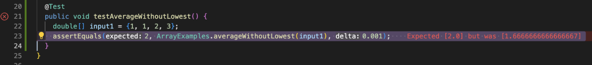

# Lab Report 2 Week 3

## Part I

```
import java.io.IOException;
import java.net.URI;
import java.util.ArrayList;

class Handler1 implements URLHandler {
    // The one bit of state on the server: a number that will be manipulated by
    // various requests.
    String str = "anewstringtoadd";
    ArrayList<String> items = new ArrayList<String>();

    public String handleRequest(URI url) {
        if (url.getPath().equals("/")) {
            return String.format("String: %s", str);
        }
        else {
            // handle add case
            if (url.getPath().contains("/add")) {
                String[] parameters = url.getQuery().split("=");
                if (parameters[0].equals("s")) {
                    items.add(parameters[1]);
                    return String.format("Item added: %s!", parameters[1]);
                }
            // handle search case
            } else if (url.getPath().contains("/search")) {
                String[] parameters = url.getQuery().split("=");
                if (parameters[0].equals("s")) {
                    ArrayList<String> itemHasS = new ArrayList<String>();
                    for(int i = 0; i < items.size(); i++) 
                        if(items.get(i).contains(parameters[1]))
                            itemHasS.add(items.get(i));
                    return itemHasS.toString();
                }
            }
            return "404 Not Found!";
        }
    }
}

class SearchEngine {
    public static void main(String[] args) throws IOException {
        if(args.length == 0){
            System.out.println("Missing port number! Try any number between 1024 to 49151");
            return;
        }

        int port = Integer.parseInt(args[0]);

        Server.start(port, new Handler1());
    }
}
```

### Example 1

When we pass the path ".../add?s=pineapple" into the method, the substring "/add" is detected by the function contains(). The code now enters the according block to handle "/add".
  - What is happening inside?
    - url.getQuery(): returns the query in a String type. In this example, getQuery() returns "s=pineapple"
    - split("="): splits the query into pieces using the deliminiter in arguments, then return them. In this example, it returns "s" and "pineapple". 
    - String[] parameters: stores the returned strings. In this example, parameter now has {"s", "pineapple"}.
    - After that, if the first element in parameter is "s", then we add the second element to the arraylist items, which stores all the added items. If this is the first add operation in the runtime, now the items array is {"pineapple"}


### Example 2

When we pass the path ".../add?s=apple" into the method, the substring "/add" is detected by the function contains(). The code now enters the according block to handle "/add".
  - What is happening inside?
    - url.getQuery(): returns the query in a String type. In this example, getQuery() returns "s=apple"
    - split("="): splits the query into pieces using the deliminiter in arguments, then return them. In this example, it returns "s" and "apple". 
    - String[] parameters: stores the returned strings. In this example, parameter now has {"s", "apple"}.
    - After that, if the first element in parameter is "s", then we add the second element to the arraylist items, which stores all the added items. If we back to last example, now items is {"pineapple", "apple"}


### Example 3

When we pass the path ".../add?s=apple" into the method, the substring "/add" is detected by the function contains(). The code now enters the according block to handle "/add".
  - The operation inside the if block are the same as Example 1&2.


### Example 4

When we pass the path ".../search?s=app" into the method, the substring "/search" is deteced by the function contains(). The code now enters the according code block to handle the search case. 
  - url.getQuery(): returns the query in a String type. In this example, getQuery() returns "s=app"
  - split("="): splits the query into pieces using the deliminiter in arguments, then return them. In this example, it returns "s" and "app". 
  - String[] parameters: stores the returned strings. In this example, parameter now has {"s", "app"}.
  - The following if statement simply checks if the first character in the query is "s". If the condition is true, then in the for loop, we adds items whose name contains "app" to a new arraylist. Last we return this arraylist, and get the output "[pineapple, apple]" based on the previous examples.


## Part II

### **1. avergeWithoutLowest(double[])**


- 👆 Input that induces the error 


- 👆 Symptom of the error


- 👆 The code in the the screenshot above contains a bug. The bug resides in the last for loop. In the for loop, all numbers except numbers with the lowest value are added to sum. However, this is wrong if we have more than one numbers that have the same lowest value. It will ignore all numbers that have the lowest value.
  - Expected return value: (1+2+3) / 3 = 2
  - Actually return value: (2+3) / 3 = 1.666...6667

***Solution:*** 
  - Sum up all numbers first, subtract a lowest value from the sum.
  - 


### **2. merge(List\<String\>, List\<String\>)**


- 👆 Input that induces the error 


- 👆 Symptom of the error. The symptom means there is an infinite loop caused by the code, and memory has been used up.


- 👆 The code in the the screenshot above contains a bug. The reason is that in Line 50 - 53, the condition of the while loop is not updated by code after each interation. Therefore, as long as the condition is satisfied, the while loop will not end until running up all memroy. 

***Solution:***
- On Line 52, change index1 to index2.
- 
