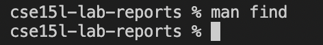

# Lab Report 3 Week 5

We are going to play around with the find command in this lab report. 

## Introduction to Find 
Find: The find utility recursively descends the directory tree for each path listed, evaluating an expression (composed of the “primaries” and “operands” listed below) in terms of each file in the tree.

More informaiton about *find* command can be found by typing "man find" in a command line terminal.


## Options

### **1. -name**

#### **Example 1**

```
(base) bensonjian@Bensons-Mac technical % find .  -name "Annual_Fee.txt" 
./government/Media/Annual_Fee.txt
(base) bensonjian@Bensons-Mac technical %
```

What happens in the above code block?
- The above command "find .  -name "Annual_Fee.txt" means walking through the current directory and looking for a file or a directory whose name is "Annual_Fee.txt".
- This command is useful when we want to look for a particular file.

#### **Example 2**

```
(base) bensonjian@Bensons-Mac technical % find .  -name "An*"   
./government/Media/Anthem_Payout.txt
./government/Media/Annual_Fee.txt
(base) bensonjian@Bensons-Mac technical % 
```

What happens in the above code block?
- The above command "find .  -name "An*"" means walking through the current directory and looking for files or directories whose name starts with "An".
- This command is useful when we want to look for files or directories but are not sure about the name.

#### **Example 3**

```
(base) bensonjian@Bensons-Mac technical % find ./government/Media -iname "A*"
./government/Media/Anthem_Payout.txt
./government/Media/Abuse_penalties.txt
./government/Media/agency_expands.txt
./government/Media/Annual_Fee.txt
./government/Media/AP_LawSchoolDebts.txt
./government/Media/Avoids_Budget_Cut.txt
./government/Media/Assuring_Underprivileged.txt
./government/Media/Attorney_gives_his_time.txt
./government/Media/All_May_Have_Justice.txt
./government/Media/Advocate_for_Poor.txt
./government/Media/A_Perk_of_Age.txt
./government/Media/A_helping_hand.txt
./government/Media/Aid_Gets_7_Million.txt
(base) bensonjian@Bensons-Mac technical % 
```

What happens in the above code block?
- The above command "find ./government/Media -iname "A*"" means walking through the specified directory and looking for files or directories whose name starts with "A" or "a".
- The -name option is case sensitive, but the -iname option is not. 
- This command is useful when we want to look for files or directories but are not sure about the name.

### **2. -type**

#### **Example 1**

``` 
% (base) bensonjian@Bensons-Mac technical % find . -type d
.
./government
./government/About_LSC
./government/Env_Prot_Agen
./government/Alcohol_Problems
./government/Gen_Account_Office
./government/Post_Rate_Comm
./government/Media
./plos
./biomed
./911report
(base) bensonjian@Bensons-Mac technical % 
```

What happens in the above code block?
- The above command means looking into the current directory, finding all directories and subdirectories and ignoring the files.
- We can also change "-type d" to "-type f", which means only looking for the file type inside the current directory. 
- This command is useful when we want to know what subdirectories the current directory has.

#### **Example 2**

```
(base) bensonjian@Bensons-Mac technical % find . -type f
... (many many files not showing)
./911report/chapter-2.txt
./911report/chapter-1.txt
./911report/chapter-5.txt
./911report/chapter-6.txt
./911report/chapter-7.txt
./911report/chapter-9.txt
./911report/chapter-8.txt
./911report/preface.txt
./911report/chapter-12.txt
./911report/chapter-10.txt
./911report/chapter-11.txt
(base) bensonjian@Bensons-Mac technical %  
```

What happens in the above code block?
- The above command means looking into the current directory, and finding files only. 
- This command is useful when we want to know what files the current directory has.

#### **Example 3**

```
(base) bensonjian@Bensons-Mac technical % find . -type d
./government
./government/About_LSC
./government/Env_Prot_Agen
./government/Alcohol_Problems
./government/Gen_Account_Office
./government/Post_Rate_Comm
./government/Media
(base) bensonjian@Bensons-Mac technical % 
```

What happens in the above code block?
- The above command means looking into the specified directory, and outputing the subdirectories only. 
- This command is useful when we want to know what directories a specified directory has.


### **3. -size**

#### **Example 1**

```
(base) bensonjian@Bensons-Mac technical % find . -size -1k
.
./government
./government/About_LSC
./government/Env_Prot_Agen
./government/Alcohol_Problems
./government/Post_Rate_Comm
./plos/pmed.0020191.txt
./plos/pmed.0020226.txt
./911report
(base) bensonjian@Bensons-Mac technical % 
```

What happens in the above code block?
- The above command means looking into the specified directory, and outputing any subdirectory or file whose size is smaller than 1k.
- This command is useful when we want to know what directories or files are within a specified of size.

#### **Example 2**

```
(base) bensonjian@Bensons-Mac technical % find . -size +200k  
./government/About_LSC/commission_report.txt
./government/Env_Prot_Agen/bill.txt
./government/Gen_Account_Office/GovernmentAuditingStandards_yb2002ed.txt
./government/Gen_Account_Office/Statements_Feb28-1997_volume.txt
./government/Gen_Account_Office/d01591sp.txt
./911report/chapter-13.4.txt
./911report/chapter-13.5.txt
./911report/chapter-3.txt
(base) bensonjian@Bensons-Mac technical % 
```

What happens in the above code block?
- The above command means looking into the specified directory, and outputing any subdirectory or file whose size is greater than 200k.
- This command is useful when we want to know what directories or files are within a specified of size.

#### **Example 3**

```
(base) bensonjian@Bensons-Mac technical % find . -size -1M
... (many many files not showing)
./911report/chapter-2.txt
./911report/chapter-1.txt
./911report/chapter-5.txt
./911report/chapter-6.txt
./911report/chapter-7.txt
./911report/chapter-9.txt
./911report/chapter-8.txt
./911report/preface.txt
./911report/chapter-12.txt
./911report/chapter-10.txt
./911report/chapter-11.txt
```

What happens in the above code block?
- The above command means looking into the specified directory, and outputing any subdirectory or file whose size is smaller than 1M.
- This command is useful when we want to know what directories or files are within a specified range of size.